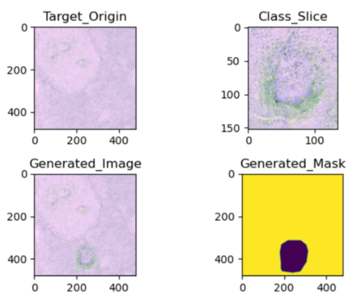
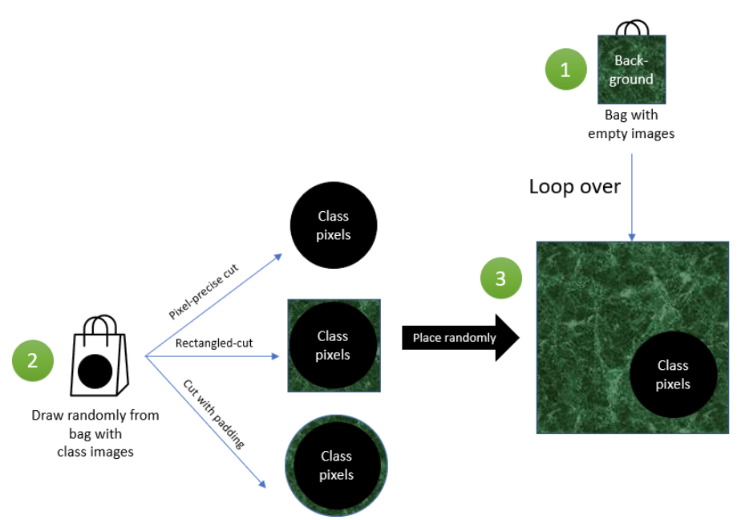
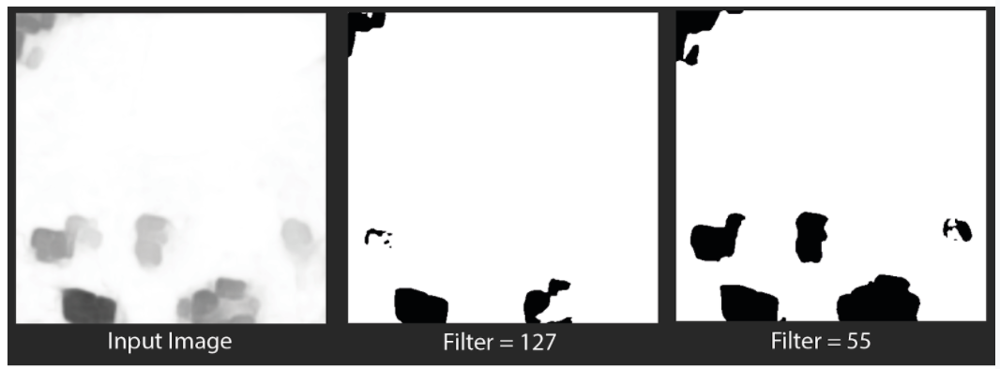
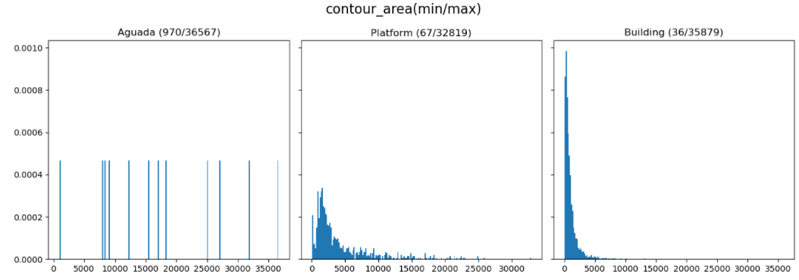
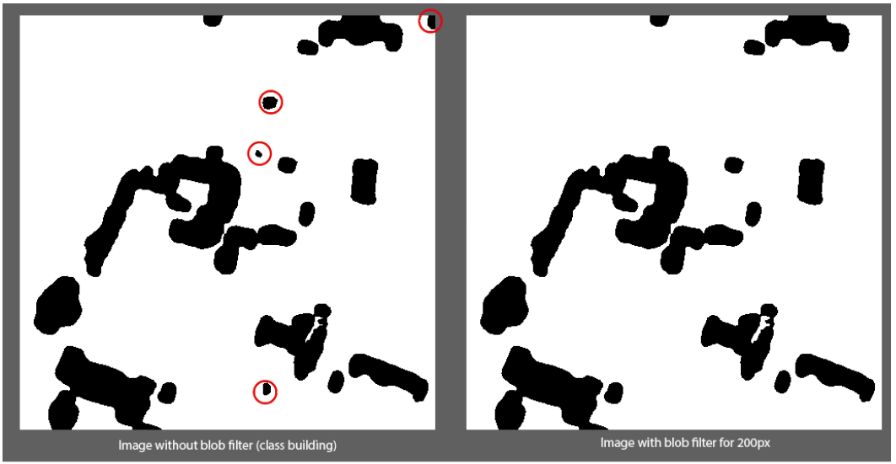
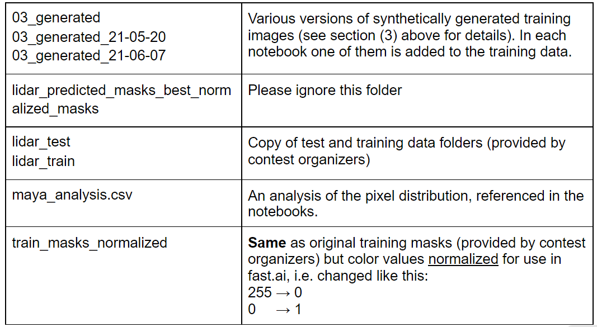

# Maya Contest Machine Learning Pipeline

Hint: for installation & run instructions go to section "Installation and Deployment"

## Overview of the solution pipeline
We applied these seven steps to obtain the results:

1. _Synthetic data generation_. As with many archaeological datasets, the original dataset turned out to have insufficient samples for the classes to be detected properly. So we use image processing techniques to create additional images and masks out of the available samples. → see section (3) Synthetic data generation below.
2. _Mask re-formatting (“normalization”)_. The library fastai (www.fast.ai) from Univ. San Francisco, which we use, requires binary segmentation masks to be “normalized” in the [0, 1] value range, so we re-formatted the provided masks from images with values [255, 0] to [0,1]. This is super easy, so we only provide the normalized masks. But in case you want the source code, just let us know.
3. _Deep Learning model training_. For each object class in {aguada, platform, building} a total of 2 x 5 neural networks are trained as follows:
    1. the LiDAR training dataset including the synthetic data (from step A above) is randomly shuffled and then split into 5 “folds” of equal size ( “K-Fold cross validation”, here K=5) which iteratively serve as validation dataset (and the remaining 4 folds are used as the training dataset), resulting into a 80% / 20% training / validation data split.
    2. Each of these 5 datasets then serves as input for training two different neural network architectures, namely:
        1. a DeepLabV3+ with ResNet-101 backbone
        2. an HRNet with HRNet_W30 backbone 
           
    For details see section (4) below.
4. _Prediction_. For each object class the resulting 2 x 5 = 10 neural network models are then used to make predictions for each image in the test dataset of the competition. The results are ensembled, that is, the mean of all predictions (in [0.0 … 1.0]) is computed (no further weights applied).
5. _Intermediate result: grayscale image_. The resulting number (mean) is then re-scaled from [0..1] to [0 255] for each pixel and stored as a grayscale image. (Note that this causes some precision loss but the effect is negligible).
6. _Apply filters_. Two filters are applied to vary thresholds for the segmentation certainty and minimal object area (see section (5) post-processing)
7.  _Convert output to npz format_. This is done based on the code provided by the competition organizers, so we do not document it here.

## Results of our data analysis
These observations were key factors when designing the solution:
1. _Sentinel satellite data not used_. For obvious reasons the Sentinel datasets are both of substantially lower resolution than the LiDAR data, so we assessed their contribution to be inferior or even negligible for the machine learning pipeline.
   The table below shows that only under super-optimistic circumstances the Sentinel data contributes only 25%+12% = 37% of the information value per tile. In reality, this is much lower, as a substantial amount of redundancy can be assumed with all bands. Although we concede that there might be useful insights, especially with the aguada class (typically relatively large objects), we dropped them completely due to lack of time.

2. _LiDAR data assessment_. 
   The LiDAR data quality is much better, although the 3 color channels consist of 3 different visualizations derived from the same LiDAR raw data. This inevitably causes some information (and hence detection quality) loss compared to using the raw data, as we have outlined in our own research on LiDAR in Deep Learning (https://doi.org/10.1016/j.culher.2020.10.009).
   But the quality is still good enough for the segmentation task.

3. _Creation of synthetic data required_. As with many archaeological datasets, the samples are heavily imbalanced: For example, only 64 of all training images have aguadas in them. A well-established possible solution for this problem is the creation of synthetic or “artificial” samples which ensure that the neural network models regularize well and improve detection quality. We also applied other methods for dealing with this imbalance. See next section for details.

## Synthetic data generation
The trend within the machine learning community is currently moving more towards a data based approach and rather away from the model-based approach. Since the amount of training data is few and the possibilities of data augmentation are limited, we decided to generate synthesized data.
In doing so, we implemented three different approaches resulting in three additional datasets, which were included into the training data (depending on their performance):
1. rectangular-cropped: compute rectangular bounding box of object, e.g. aguada
2. pixel-precise-cropped: compute precise border line of object
3. padded: same as (2) but add N pixels padding outside the object.
The pipeline looks as follows: We split the training images into two groups: either images showing a class (Auguada, Building, Platform) or empty images without any class.
From images showing a class we copy the pixels of interest in one of the three styles (rectangular-cropped, pixel-precise or padded).

_Fig. 1: The four stages to produce more images for training. We first take an empty image (Target_Origin) and randomly pick a cropped class image (Class_Slice). We finally put the Class_Slice into Target_Origin and save the corresponding mask._

We then loop over all empty images. For each empty image (ref. Target_Origin), we randomly copy a cropped image (Class_Slice) and paste it at a random location in the empty image. We store the information where the class image was inserted and generate a mask (Generated_Mask) from it. For details of the pipeline, see Fig. 2.

_Fig. 2: Pipeline for generating images. (1) We have a bag of empty images, (2) then draw randomly from a list of class images, cut them using one of the three fashions (pixel-precise, rectangled, or with padding) and (3) finally, place them randomly into the background image._

## Training the Machine Learning Models
Details of the deep learning process are documented in the six Juypter notebooks (2x3 = two for each architecture (DeepLabV3+ or HRnet), three for each of the classes) submitted:

'Seg_J040 aguada like J036 HRnet  BEST AGUADA.ipynb'

'Seg_J041 aguada like J040 but DeeplabV3+  BEST AGUADA.ipynb'

'Seg_J040b platform like J036 DeeplabV3+ BEST PLATFORM.ipynb'

'Seg_J041 platform like J040b but HRnet BEST PLATFORM.ipynb'

'Seg_J040c building like J040c but DeeplabV3+ BEST BUILDING.ipynb'

'Seg_J040d building like J036 HRnet BEST BUILDING.ipynb'

(the numbers in the filenames are version numbers, only best version is submitted)

To give an overview, these SOTA (State-of-the-art) techniques were used:
- fast.ai library on top of Pytorch (www.fast.ai)
- SemTorch library as a provider for segmentation models (DeepLabV3+ with ResNet-101 backbone and HRNet with HRNet_W30 backbone) https://github.com/WaterKnight1998/SemTorch)
- data augmentation techniques:
  - using synthetic images (see above). This gave a substantial performance boost. We tried various combinations of the synthetic images, and it appears that each has their advantage, depending on the class being trained. See notebooks for details and the particular set of images used.
  - oversampling of the minority class: only for aguadas the training image/mask samples containing aguada pixels were duplicated 6 times during training.
  - These image data augmentation techniques from the fast.ai library were used:
    - Resize(imgsize) → resizes all images to a given size
    - Dihedral() → randomly applies horizontal and vertical flips
    - Brightness(0.1,p=0.25) → randomly modifies the image brightness
    - Zoom(max_zoom=1.1,p=0.25) → randomly zooms the images
    - Normalize.from_stats(*imagenet_stats) → normalizes all images to the Imagenet statistics
  - In addition, Cutmix data augmentation (https://arxiv.org/abs/1905.04899) helped for some classes.
- Progressive resizing: Each model was trained twice, once with half size and once with full size (480 by 480 pixels) images. This helped models regularize better. Besides, it reduces training time.
- Focal loss as loss function: works well for imbalanced data (https://arxiv.org/abs/1708.02002)
- Mixed precision training: Unlike other frameworks, the fastai library can invoke Nvidia CUDA for training with either 16 or 32 bit float numbers. We always train with 16 bit except for the last training run. This not only saves time but also improves model performance through better regularization (as suggested in [1] )
- k-fold cross validation: see https://machinelearningmastery.com/cross-validation-for-imbalanced-classification/ for example. We use five folds here.
- Modern training loop: we utilize these SOTA improvements over other training frameworks (inspired by https://lessw.medium.com/how-we-beat-the-fastai-leaderboard-score-by-19-77-a-cbb2338fab5c, see there for details):
    - Replacing Adam optimizer with Ranger (Rectified Adam + Lookahead)
    - Replacing OneCycle training with Flat + cosine annealing training cycle

### Ensembling
The training results in 30 models (3 classes x 2 architectures x 5 folds). For each class we ensemble the corresponding 10 models during prediction. See notebook

_Seg_Predictor_007 ensemble.ipynb_

for details. In essence we compute the (unweighted) mean of all 10 predictions for each pixel and store it in a grayscale image. The image then corresponds to the output of the last layer or the ensembled network (i.e. the probabiliby or confidence score) and serves as input for the post-processing step.

## Post-Processing
The output of the pipeline so far is then represented as grayscale images for each class. Hereby, the probability score is scaled up from [0,1] to [0,255]. In the post-processing steps, we apply two thresholds. One refers to the greyscale value to be accepted as class value and the other threshold filters the resulting binary blobs for a minimal size. Both parameters are tested in combination to improve the results.

### Probability Filtering
In our scripts, this section refers to the upper part of  the combine_pipeline code. The related parameter is denoted as threshold. The script is very simple, as it only converts the greyscale images (input) to binary images (masks) based on the requested threshold.

_Fig.3:  Effects of probability filtering_

The lower the threshold, the more pixels are accepted as class pixels. The standard generation of binary images refers to the threshold 127 (which represents the probability p=0.5). Each class can be filtered with its own threshold.

Note that lowering the threshold may cause artifacts and more false positive misclassifications. In combination with blob filtering, these unwanted side effects might be reduced.

### Blob Filtering
This method aims to remove small artifacts and areas, which might be too small to be considered an actual class. In advance we tried to get an impression of suitable thresholds by analyzing blob sizes, ratios and contours, but failed to get a threshold to perform a nice separation between the classes.

_Fig.4:  Evaluation of the area in px for all three classes_

Again, each class has its own blob filter threshold. In the script combine_pipeline, this refers to the lower part. The variable blob represents the min area in pixels to be filtered.

A side effect of the blob filter is that it removes small artifacts at the border, which might be caused as the object is only partially seen in the image. We are aware of this effect, but did not try to evaluate it anymore. Theoretically, different thresholds could be applied for blobs which are found at the image border to tackle this problem.

## Installation and Deployment
In this section, instructions can be found to follow and reproduce our results with the provided code.

### Synthetic data generation

The code for this including a ReadMe file with further instructions to get the code run can be found [here](https://drive.google.com/drive/u/1/folders/1bX0xLqvOZwdnNvjdIRveAPfc6_7TBGkx).

### Mask re-formatting
Fast.ai requires masks in another format, and we provide the re-formatted masks for download: See folder “train_masks_normalized” in maya.zip below. The normalization is super simple - we basically invert the colors:

    for f in fnames: # for all mask file names
        im = IM.open(f)
        pix = np.array(im)
        pix[pix==0] = 1	# replace 0 with 1
        pix[pix==255] = 0	# replace 255 with 0
        im = IM.fromarray(pix)
        im.save(path_out/f.name)

### Deep Learning model training

#### Platform
The Deep Learning model has been run on two different platforms to speed up development:

1. a PC with Ubuntu 18.04, 32 GB memory, NVIDIA RTX 2060 SUPER with 8 GB GRAM.
Software: Python=3.7.7, Pytorch=1.9, Fastai=2.4

2. a cloud instance from jarviscloud.com with NVIDIA RTX5000 (16 GB GRAM), 32 GB memory.
Software: Python=3.6.10, Pytorch=1.7.1, Fastai=2.4

Other dependencies:
- the fast.ai library is pip-installed from within the notebooks.
- the notebooks also use pip to install SemTorch from https://github.com/WaterKnight1998/SemTorch. Caution: do not install this from pypi as that version is broken.

We believe that the hyperparameters (batch size) configured in the submitted code here are sufficient for the smaller platform (1) but if you encounter memory problems please use the larger configuration (2). We are glad to assist.

#### Installation & running
The easiest way to set up the data is to run the notebook bootJarvisMaya.ipynb which we used to set up cloud instances:

1. set up a new directory “./Notebooks”. Copy all notebooks from our repository to this folder.

2. run bootJarvisMaya.ipynb from there. It will download “maya.zip” from our Google Drive (see link above) and copy everything into “../Data”. See table below for explanation of contents.

3. then run the six notebooks Seg*.ipynb to create the 30 deep learning models. Their output is then in the sub-folder models, i.e. “./Notebooks/models”

CAUTION: This computation took approx. 34 hours on our platforms. To save time, you might want to consider running only one or two of the notebooks as they differ only in configuration to verify that they indeed provide good results. And we provide all 30 resulting models for you, see next section.

#### Intermediate result: models
The resulting 30 models as Pytorch *.pkl files are available in this [Google Drive folder](https://drive.google.com/drive/u/1/folders/16N8y68-nvwn1CnYcSbRjYuLvrznNt-3-):
We recommend to use these for the next step “Prediction”. Or re-create them with the process described above.

### Prediction
For prediction, simply run Seg_Predictor_007 ensemble.ipynb
(same computation platform as above). Note that this must be run 3 times to obtain predictions for all 3 classes. To change classes, go to cell #4 of the notebook and uncomment the class you want to predict. For example, aguada: 

_Class Parameters for the prediction script_

#### Intermediate result: grayscale images

The output of our predictions are grayscale images resembling the Neural Network output rescaled to [0..255] for the next step (filtering). They are stored in

../Data/lidar_predicted_masks_FULL

Our results are also available at our [Google Drive](https://drive.google.com/file/d/1a1qoIirw1YmTTNi7SyQBb50j5uhRY_me/view) as lidar_predicted_masks_FULL.zip.

### Apply filter
The post-processing is applied in a Python 3 environment (v3.9.5). The required libraries can be installed via requirements-post-processing.txt

Note that this is an environment different from the ones shown above.

The required input are all grayscale images generated in the previous step. These images can be either generated, or obtained from the lidar_predicted_masks_FULL.zip file in the data folder.

Finally, the script combine_pipeline can be executed. Unfortunately, the script has to be executed for each class once. The output of the script consists of two folders. Those two folders appear in the same directory where the script was executed: One folder with the scheme “all_masks_t_{threshold}” for the results of the probability filter, and one filter with the scheme “all_masks_t_{threshold}_min_{blob}” with the blob filtered images. In these folders, all three classes are contained. Therefore, the correct masks have to be copied manually to a final submission folder. Finally, this final submission folder denotes the input for the submission script, which generates the zip file to be uploaded to the codalab system.

# Literature

[1] Howard, J., Gugger, S.: Deep Learning for Coders with Fastai and PyTorch: AI Applications Without a PhD, 2020, O'Reilly Media